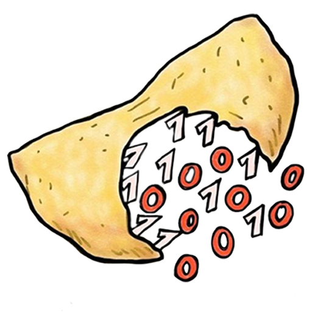

# ITASEC2023 - HighSchools CTF Workshop

Challenge per l'HighSchools CTF Workshop di ITASEC2023 @ Bari - 02/05/2023

## Credits

Le challenge qua presenti sono state sviluppate dai membri dei team [M0NT3C4RL0](https://www.mntcrl.it/) dell'Università di Bari e [pwnzer0tti](https://pwnzer0tt1.it/) del Politecnico di Bari per l'HighSchools CTF Workshop tenutosi ad ITASEC23 il 2 Maggio 2023 a Bari.

  
  

## Challenges

| Category | Title                                           | Author                                                     |      Dynamic       | Type |                         Url | Port |
| :------- | :---------------------------------------------- | :--------------------------------------------------------- | :----------------: | ---: | --------------------------: | :--: |
| crypto   | [remix](crypto/crypto01)                        | Nicola Pace <@nicolapace>                                  |        :x:         |      |                             |      |
| crypto   | [HEXacly 5 t1mes](crypto/crypto02)              | Daniele Di Spirito <@DanieleDiSpirito>                     |        :x:         |      |                             |      |
| crypto   | [X0rland1a](crypto/crypto03)                    | Daniele Di Spirito <@DanieleDiSpirito>                     | :heavy_check_mark: | http |  xorlandia.challs.itasec.it | 8080 |
| crypto   | [CryptoMeme](crypto/crypto04)                   | Vincenzo Cantatore <@M0rthimer>                            |        :x:         |      |                             |      |
| crypto   | [Remote mtp](crypto/crypto05)                   | Vincenzo Cantatore <@M0rthimer>                            | :heavy_check_mark: | http |  remotemtp.challs.itasec.it | 8081 |
| crypto   | [Bad at math](crypto/crypto06)                  | Nicola Pace <@nicolapace>                                  | :heavy_check_mark: | http |   badatmat.challs.itasec.it | 8082 |
| network  | [Basic Shark](network/network01)                | Nicola Guerrera <@nik012003>                               |        :x:         |      |                             |      |
| network  | [Hidden cats](network/network02)                | Nicola Guerrera <@nik012003>                               |        :x:         |      |                             |      |
| network  | [Top Secret Base](network/network03)            | Claudio Ripa <@ripac99>                                    |        :x:         |      |                             |      |
| network  | [Banana Split](network/network04)               | Nicola Guerrera <@nik012003>                               |        :x:         |      |                             |      |
| network  | [Decrypt Me](network/network05)                 | Luigi Amendolagine <@Lu191>                                |        :x:         |      |                             |      |
| network  | [Noisy Bits](network/network06)                 | Salvatore Abello <@salvatore-abello>                       |        :x:         |      |                             |      |
| osint    | [Uno strano incontro...](osint/osint01)         | Pierluigi De Palo <@gigi0>                                 |        :x:         |      |                             |      |
| osint    | [...con uno strano imprenditore](osint/osint02) | Pierluigi De Palo <@gigi0>                                 |        :x:         |      |                             |      |
| osint    | [Un giro sugli "alberi"](osint/osint03)         | Pierantonio D'Agostino <@KorSetta>                         |        :x:         |      |                             |      |
| osint    | [La macchina del tempo](osint/osint04)          | Pierantonio D'Agostino <@KorSetta>                         |        :x:         |      |                             |      |
| osint    | [Suonano al citofono...](osint/osint05)         | Oscar Urselli <@Polonium>                                  |        :x:         |      |                             |      |
| osint    | [Chi cerca, trova!!!](osint/osint06)            | Oscar Urselli <@Polonium>                                  |        :x:         |      |                             |      |
| web      | [Galleria Vettoriale](web/web01)                | Vito Cafagno <@Alcu.ino>                                   | :heavy_check_mark: | http |  vectorial.challs.itasec.it | 8083 |
| web      | [CookieC(TF)liker1](web/web02)                  | Gianluca Parisi <@whyn0>                                   | :heavy_check_mark: | http |     cookie.challs.itasec.it | 8084 |
| web      | [CookieC(TF)liker2](web/web03)                  | Gianluca Parisi <@whyn0>                                   | :heavy_check_mark: | http |     cookie.challs.itasec.it | 8084 |
| web      | [ITASECshop - 1mln$ Flag](web/web04)            | Domingo Dirutigliano <@DomySh>, Vincenzo Turturro <@Sush1> | :heavy_check_mark: | http | itasecshop.challs.itasec.it | 8085 |
| web      | [ITASECshop - Fridge Flag](web/web05)           | Domingo Dirutigliano <@DomySh>, Vincenzo Turturro <@Sush1> | :heavy_check_mark: | http | itasecshop.challs.itasec.it | 8085 |
| web      | [ITASECshop - H4ck3d](web/web06)                | Domingo Dirutigliano <@DomySh>, Vincenzo Turturro <@Sush1> | :heavy_check_mark: | http | itasecshop.challs.itasec.it | 8085 |
