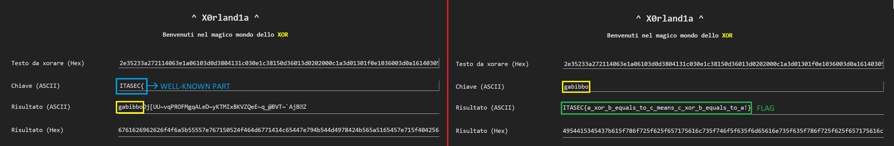

# ITASEC23 - CTF Workshop

## [crypto] X0rland1a (14 risoluzioni)

La challenge consiste in una semplice implementazione di un attacco allo xor in cui chiave è troppo corta, quindi ripetuta, conoscendo una parte della flag.

