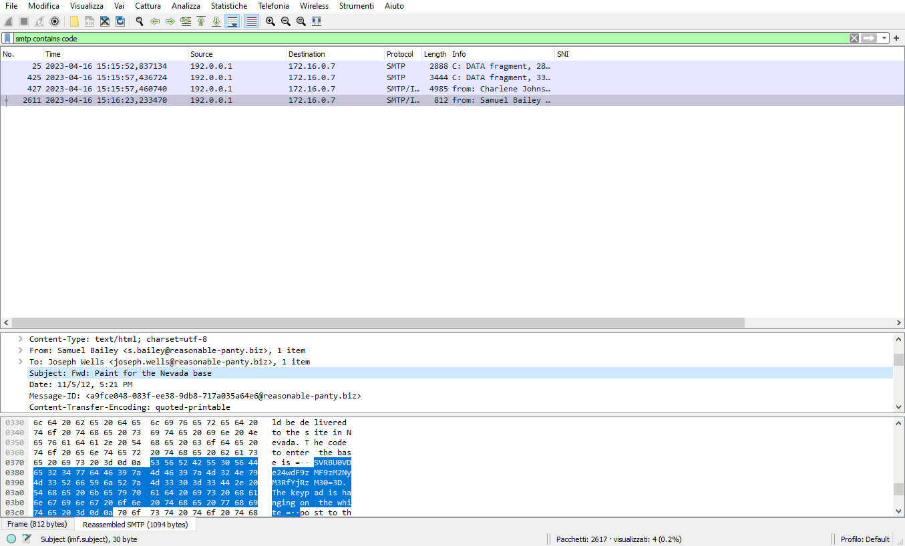

# ITASEC23 - CTF Workshop

## [network] Top Secret Base (7 risoluzioni)

La flag è nascosta nel testo di uno dei messaggi, codificata in base64.

Per trovare la flag, filtrare i pacchetti utilizzando filtri come "smtp contains base" oppure "smtp contains code".

Tra i messaggi filtrati, uno in particolare avrà come oggetto "Paint for the Nevada base".

Trovato il codice di accesso in base64, è sufficiente decodificarlo per ottenere la flag.
