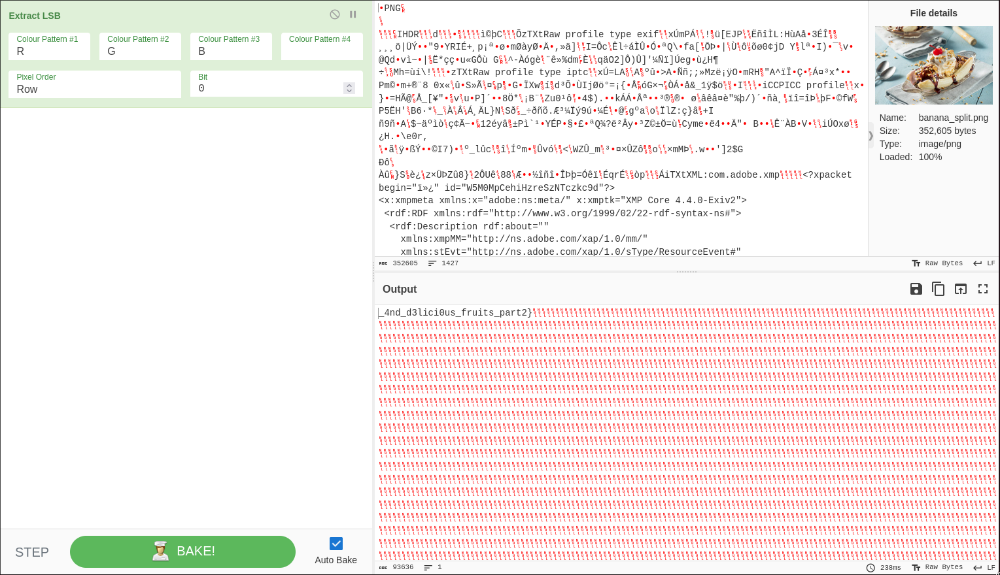

# ITASEC23 - CTF Workshop

## [network] Banana Split (5 risoluzioni)

Questa challenge è divisa in due parti:

### Parte 1 (exif)

La prima parte della flag è stata codificata nel nome dell'artista, all'interno dei metadati exif dell'immagine in formato jpg.
Per estrala basta utilizzare un tool come exiftool.

```bash
$ exiftool banana.jpg
...
Description                     : ITASEC{I_lik3_d3ss3rts_part1
...
```

#### Parte 2 (steganografia LSB)

La seconda parte è stata nascosta nell'immagine in formato png tramite steganografia LSB (Least significant bit).
Ogni pixel dell'immagine è formato da 3 byte, che rappresentano l'intensità del colore R, G e B. Il bit meno significativo di ogni byte, è utilizzato per codificare la stringa contenente la seconda parte della flag.

Per ottenere la flag usiamo un tool come stegoveritas:

```text
stegoveritas split.png
```

Oppure la funzione Extract LSB di Cyberchef:

