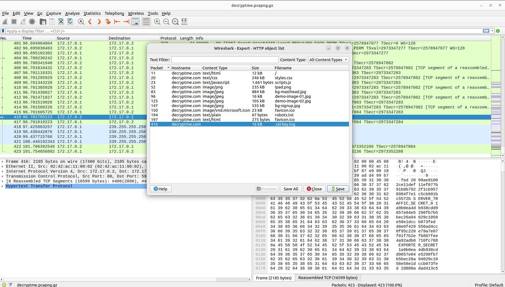

# ITASEC23 - CTF Workshop

## [network] Decrypt Me (5 risoluzioni)

La flag è nascosta nel corpo delle richieste **`HTTPS`**, ogni pezzo della flag codificato in `base64`.

Per poter decriptare il traffico **`HTTPS`** sappiamo che necessitiamo delle chiavi della sessione **SSL**

Dopo aver notato che nel file sono presenti anche delle richieste **`HTTP`** proviamo a utilizzare una delle feature di **Wireshark**, che ci permette di esportare eventuali file che sono stati richiesti `File --> Export Objects --> HTTP`.

Tra i file selezionabili quello che salta all'occhio è il file `.ssl-key.log`, perciò ci salviamo tale file.

Dopo aver verificato che effettivamente il file contenesse le chiavi della sessione **SSL** di interesse, possiamo utilizzarlo per decriptare il traffico.

Dal menu di **Wireshark**, `Edit --> Preferences` e selezionare il menu a tendina `Protocols`, trovare la voce `TLS`, e infine, selezionare il file precedentemente salvato nel campo `(Pre)-Master-Secret log filename`

A questo punto, è possibile notare che è stato decriptato con successo il traffico; le richieste effettuate non in chiaro sono state eseguite ai seguenti endpoint: `/secret/3NC0d3d1.html`, `/secret/3NC0d3d2.html`, `/secret/3NC0d3d3.html` e `/secret/3NC0d3d4.html`

Leggendo il corpo delle risposte, è possibile notare che il template è identico, e l'unica cosa che cambia tra le 4 richieste è una stringa, presumibilmente codificata in `base64`.

Utilizzando il terminale o [Cyberchef](https://gchq.github.io/CyberChef/) è possibile decodificare la stringa, per ognuna delle 4 risposte e, infine, unendo i 4 pezzi della flag si ottiene la flag completa.
