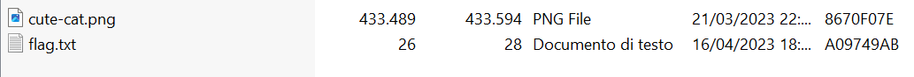

# ITASEC23 - CTF Workshop

## [network] Noisy Bits (2 risoluzioni)

Ci viene dato un file bitmap contenente la seguente immagine:


Si può già notare qualcosa di strano: i pixel sono solamente di due colori: `bianco` e `nero`. Questo perché quest'immagine rappresenta un file, e quei colori rappresentano dei bit posti a 1 oppure a 0.

Per recuperare il file rappresentato in quest'immagine ci basta quindi prendere tutti i valori rappresentati dai pixel, convertirli in una stringa binaria e convertire la stringa binaria in byte.

Questo script python può aiutarci a recuperare quel file:

```py
import os
import sys
from PIL import Image


def main():
    filename = input("filename\n> ")
    if not os.path.exists(filename):
        print("File not found")
        sys.exit(1)

    print("Reading data...")
    raw = Image.open(open(filename, "rb")).tobytes()
    bin_str = bytes([(x&1)+48 for x in raw]).decode()

    decoded = bytes(int(bin_str[i:i+8], 2) for i in range(0, len(bin_str), 8))

    print("Writing to file")
    with open("output", "wb") as f:
        f.write(decoded)
    print("Done")


if __name__ == "__main__":
    main()

```

Con il comando `file` si può vedere il tipo di file:

```sh
sal@LAPTOP-K6PV3EII:~$ file output
output: Zip archive data, at least v2.0 to extract, compression method=deflate
```

Nella zip troveremo due file:


Ovviamente, il file `flag.txt` conterrà la flag:

```sh
sal@LAPTOP-K6PV3EII:~$ cat flag.txt
ITASEC{n0t_s0_n01sy_b1ts!}
```
