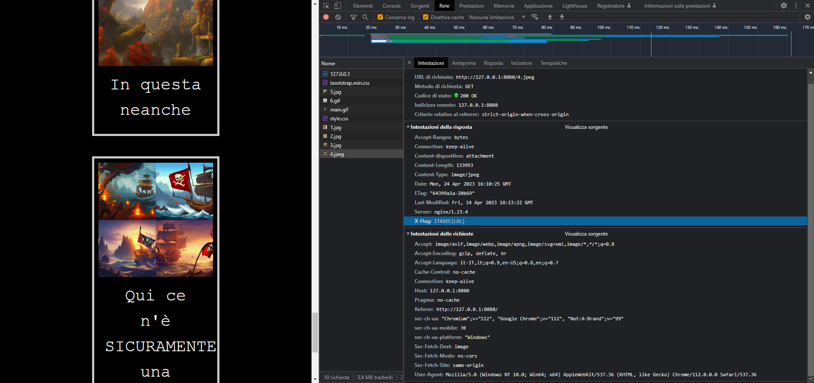

# ITASEC23 - CTF Workshop

## [web] Galleria Vettoriale (13 risoluzioni)

La flag è nascosta nell'header della richiesta HTTP per la foto dei pirati (4.jpg), con parametro "X-Flag".

Per risolvere la challenge si può leggere dai devtools, rete, andando a prendere la richiesta interessata.

