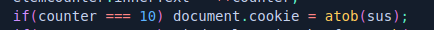
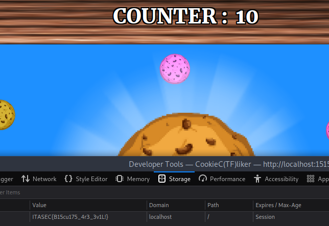
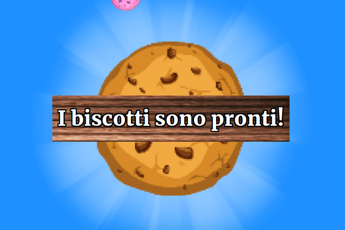

# ITASEC23 - CTF Workshop

## [web] CookieC(TF)liker1 (22 risoluzioni)

La flag si ottiene cliccando **10** volte sul biscotto centrale

e controllando i cookie settati nei devtools.

Il giocatore e' avvisato del cambiamento di stato nella webapp da un alertbox che cade dopo dieci click.

