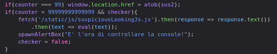
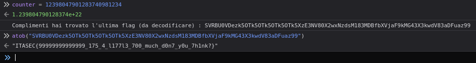
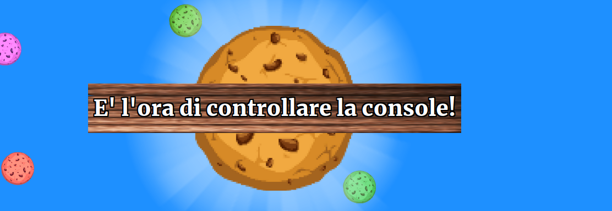

# ITASEC23 - CTF Workshop

## [web] CookieC(TF)liker2 (29 risoluzioni)

La flag si ottiene settando la variabile counter ad un numero arbitrario maggiore di **_99999999999999_** e poi cliccando sul biscotto centrale per triggerare la funzione di check del contatore.

Una volta eseguita questa operazione, il codice javascript esegue una fetch sullo script _suspiciousLookingJs.js_ su cui viene nuovamente eseguito un eval e stampata la flag encodata in base64.

Il giocatore e' avvisato del cambiamento dello stato della webapp da un alertbox che lo invita a controllare la console.

